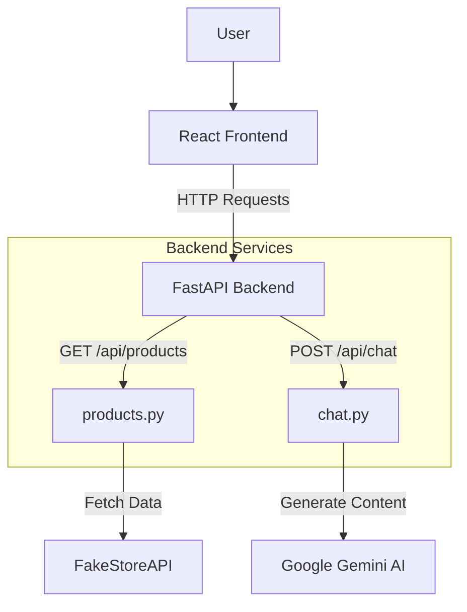

# Web Shop Project Journey & Technical Documentation

This document serves as a comprehensive guide to understanding the **Sellix** Web Shop project. It details the user journey, technical architecture, file responsibilities, and how different code blocks integrate to create a functional application.

## 1. Project Overview

**Sellix** is a modern, full-stack e-commerce application designed to demonstrate a seamless shopping experience integrated with AI assistance.

### Tech Stack
*   **Frontend**: React (Vite), Tailwind CSS, React Router DOM.
*   **Backend**: Python FastAPI, Uvicorn.
*   **Database/Data Source**: FakeStoreAPI (for product data).
*   **AI Integration**: Google Gemini API (via `google-generativeai` SDK).
*   **State Management**: React Context API (`CartContext`).

---

## 2. Architecture & Data Flow

The application follows a standard Client-Server architecture.

---

## 3. User Journey & Code Integration

This section walks through the user's experience and traces it back to the specific code blocks responsible for each action.

### A. Landing on the Application
**What happens**: The user sees a modern, responsive layout with a header, product grid, and a floating chat widget.
**Code Path**:
1.  **Entry Point**: `frontend/src/main.jsx` initializes the app and wraps it in `BrowserRouter` and `CartProvider`.
2.  **Layout**: `App.jsx` renders the `Layout` component, which includes the `Header` and the `ChatWidget`.
3.  **Routing**: `Routes` in `App.jsx` load the `Home` component for the `/` path.

### B. Browsing Products
**What happens**: The user sees a list of products with images, titles, and prices.
**Code Path**:
1.  **Component**: `frontend/src/components/ProductList.jsx`.
2.  **Data Fetching**:
    *   `ProductList` makes a `fetch('http://localhost:8000/api/products')` call on mount (`useEffect`).
    *   **Backend Integration**: The request hits `backend/main.py`, which routes it to `backend/products.py`.
    *   `products.py` fetches real data from `https://fakestoreapi.com/products` and returns it to the frontend.
3.  **Rendering**: The frontend maps over the returned JSON array and renders product cards.

### C. Adding Items to Cart
**What happens**: The user clicks the "Add to Cart" button on a product. The cart counter in the header updates.
**Code Path**:
1.  **Action**: Inside `ProductList.jsx`, the `addToCart(product)` function is called.
2.  **State Management**: `frontend/src/context/CartContext.jsx` provides the `addToCart` function via the `useCart` hook.
    *   **Logic**: It checks if the item exists. If yes, it increments quantity; if no, it adds the new item.
    *   **Persistence**: `useEffect` in `CartContext` saves the cart state to `localStorage` whenever it changes, ensuring data persists across refreshes.

### D. Managing the Cart
**What happens**: The user clicks the "Cart" button in the header. A drawer slides in from the right showing selected items.
**Code Path**:
1.  **Trigger**: `Layout` in `App.jsx` passes an `onOpenCart` prop to the header button.
2.  **Component**: `CartDrawer.jsx` is rendered at the root level in `App.jsx` but controlled by `isCartOpen` state.
3.  **Interaction**:
    *   Users can update quantity (`updateQuantity`) or remove items (`removeFromCart`)—all logic resides in `CartContext.jsx`.
    *   The "Checkout" button navigates the user to `/payment`.

### E. AI Shopping Assistant
**What happens**: The user clicks the floating chat button and asks for recommendations. Current context: "I need a gift for my dad."
**Code Path**:
1.  **Component**: `frontend/src/components/ChatWidget.jsx`.
2.  **API Call**: When the user sends a message, `sendMessage` makes a `POST` request to `http://localhost:8000/api/chat`.
3.  **Backend Logic (`backend/chat.py`)**:
    *   Receives the message.
    *   Checks for the `GOOGLE_API_KEY`.
    *   **Prompt Engineering**: Constructs a system prompt defining the "Sellix Shopping Assistant" persona.
    *   Calls Google Gemini API.
    *   Returns the AI's response to the frontend.

### F. Checkout & Payment
**What happens**: The user proceeds to checkout, reviews the order, and clicks "Pay Now". A success modal appears.
**Code Path**:
1.  **Page**: `frontend/src/pages/Payment.jsx`.
2.  **Logic**:
    *   Retrieves cart totals using `useCart`.
    *   `handlePayment` simulates a network request with `setTimeout`.
    *   On completion, calls `clearCart()` (from Context) and shows a success overlay.

---

## 4. File-by-File Technical Deep Dive

### Backend (`/backend`)

#### `main.py`
*   **Role**: The application server entry point.
*   **Key Code**:
    *   `FastAPI()`: Initializes the app.
    *   `CORSMiddleware`: Configured to allow all origins (`*`), necessary because Frontend (port 5173/3000) talks to Backend (port 8000).
    *   `app.include_router(...)`: Mounts the modular routers from other files.

#### `products.py`
*   **Role**: Product data service.
*   **Key Code**:
    *   `requests.get(...)`: Acts as a reverse proxy. It hides the upstream API source (`fakestoreapi`) from the client, allowing you to swap data sources later without changing frontend code.

#### `chat.py`
*   **Role**: AI logic handler.
*   **Key Code**:
    *   `genai.configure`: Sets up the Gemini client.
    *   `system_context`: A large multi-line string that defines the AI's personality and rules (e.g., "Do not hallucinate prices").
    *   **Fallback Logic**: If the API key is missing or the call fails, it gracefully returns a "Mock AI" response so the app doesn't crash.

### Frontend (`/frontend/src`)

#### `App.jsx`
*   **Role**: The skeleton of the UI.
*   **Key Code**:
    *   `Layout` Component: Ensures the Header and ChatWidget are always visible.
    *   `Routes`: Maps URLs to page components.

#### `context/CartContext.jsx`
*   **Role**: Global State Management.
*   **Key Code**:
    *   `createContext()`: Creates the state container.
    *   `useState` with initialization function: `useState(() => JSON.parse(localStorage...))` is a performance optimization to read from storage only once on load.

#### `components/ChatWidget.jsx`
*   **Role**: AI Interaction UI.
*   **Key Code**:
    *   `messages` Array State: Stores the conversation history (`{ role: 'user' | 'system', content: '...' }`).
    *   `messagesEndRef`: Uses a `ref` and `scrollIntoView` to auto-scroll to the newest message.

#### `pages/Payment.jsx`
*   **Role**: Checkout process.
*   **Key Code**:
    *   **Mock Payment**: Instead of a real gateway (like Stripe/Razorpay), it uses a timer to simulate processing, then clears the global cart state.

---

## 5. Key Technical Concepts

1.  **Component-Based Architecture**: The UI is built from small, reusable pieces (`ProductList`, `CartDrawer`). Changes in one component don't break others.
2.  **Proxy Pattern**: The backend acts as a proxy for product data. This solves CORS issues with external APIs and adds a security layer.
3.  **Context API**: Avoids "prop drilling" (passing data down 10 layers). The `CartProvider` wraps the whole app, so *any* component can access `addToCart` or `cartCount` instantly.
4.  **Prompt Engineering**: The AI isn't just "raw" Gemini. It's "wrapped" in a specific persona ("You are the Sellix assistant...") defined in `chat.py` to ensure relevant and safe answers.
